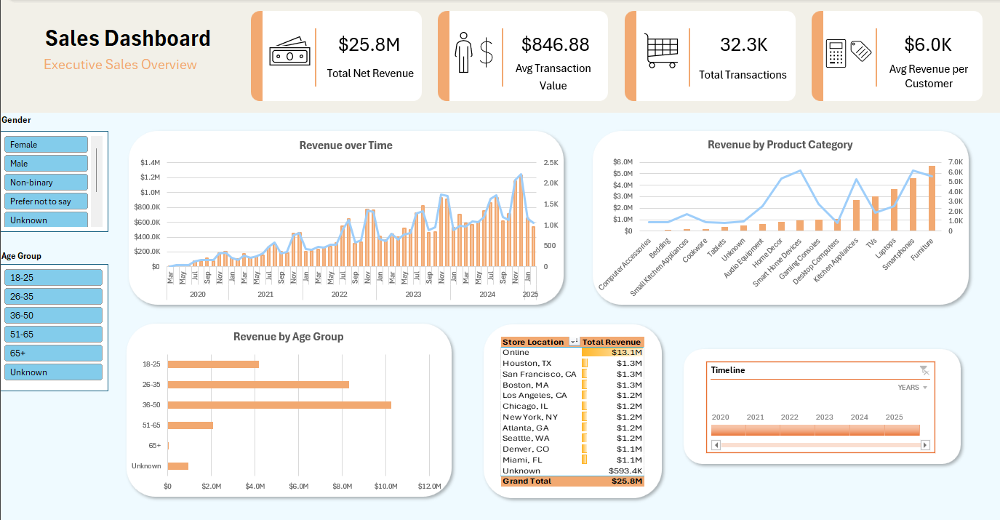

# Excel Sales Dashboard – Retail Data Analysis

## Project Overview
This project demonstrates an end-to-end sales analysis workflow using **Microsoft Excel and Power Query**.  
The goal was to transform raw retail transaction and customer data into a clear, interactive **executive-level sales dashboard** supporting business decision-making.

The dashboard enables analysis of revenue trends, product performance, and customer segments with dynamic filtering.

---

---

## Dataset
The analysis is based on a retail dataset containing:
- Transactions
- Customer demographics
- Sales channels and store locations

Data source: Kaggle – Retail Customer and Transaction Dataset
https://www.kaggle.com/datasets/raghavendragandhi/retail-customer-and-transaction-dataset?select=transactions.csv

---

## Tools & Techniques
- **Excel**
- **Power Query** for data import, cleaning, and transformation
- Data modeling and table joins
- Calculated KPIs using Excel formulas
- **Pivot Tables & Pivot Charts**
- **Slicers and Timeline** for interactivity
- Dashboard layout and visual storytelling

---

## Data Preparation
- Imported multiple CSV files using Power Query
- Cleaned and standardized data types (dates, categories, missing values)
- Merged transaction and customer data into a single analytical table
- Created derived fields (age groups, KPIs)

All transformations are fully automated and refreshable.

---

## Key KPIs
- Total Net Revenue  
- Total Transactions  
- Average Transaction Value  
- Average Revenue per Customer  

KPIs update automatically when data is refreshed.

---

## Dashboard Features
- Revenue trends over time with comparison to transaction volume
- Product category analysis using combo charts (revenue vs quantity)
- Customer segmentation by age group
- Revenue distribution by store location
- Interactive filtering using slicers and timeline

---

## Key Business Insights
- Online sales account for over **50% of total revenue**, indicating strong e-commerce dominance.
- Revenue growth is primarily driven by an **increase in transaction volume**, rather than higher basket value.
- Customers aged **36–50** generate the highest share of revenue.
- Several product categories show **high revenue with low unit sales**, suggesting premium pricing strategies.

---

## Files in This Repository
- `excel_portfolio.xlsx` – Excel file with Power Query model and interactive dashboard
- `dashboard_screenshot.png` – Preview of the final dashboard
- `README.md` – Project documentation

---

## Use Case
This project reflects real-world tasks performed by:
- Business Analysts
- Data Analysts
- BI / Reporting Analysts

It focuses on translating data into actionable business insights rather than purely technical implementation.

## Author
Created by **Daniel Maher**  
Background: Applied Mathematics  
Skills: Excel, Power Query, SQL, Power BI, Python
